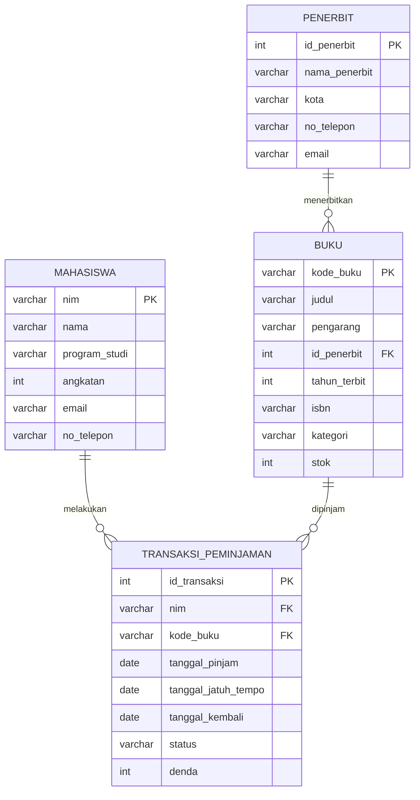

# Tugas Mandiri: Perancangan ERD E-Library Kampus

**Nama:** Isyraq Awwal Uthorid
**NIM:** D121241075

## 1. Deskripsi Skenario

Sistem E-Library Kampus mengelola proses peminjaman buku perpustakaan. Sistem perlu
menyimpan data mahasiswa sebagai peminjam, data buku beserta penerbitnya, dan riwayat
setiap transaksi peminjaman hingga pengembalian buku.

## 2. Identifikasi Entitas dan Relasi

Berdasarkan skenario, teridentifikasi empat entitas utama:

| Entitas | Deskripsi |
|---|---|
| Mahasiswa | Pihak yang meminjam buku |
| Buku | Koleksi buku yang tersedia di perpustakaan |
| Penerbit | Pihak yang menerbitkan buku |
| Transaksi Peminjaman | Catatan peminjaman dan pengembalian buku oleh mahasiswa |

Relasi antar entitas:

| Relasi | Kardinalitas | Keterangan |
|---|---|---|
| Penerbit - Buku | 1 ke N | Satu penerbit dapat menerbitkan banyak buku, satu buku hanya diterbitkan oleh satu penerbit |
| Mahasiswa - Transaksi Peminjaman | 1 ke N | Satu mahasiswa dapat melakukan banyak transaksi peminjaman |
| Buku - Transaksi Peminjaman | 1 ke N | Satu buku dapat dipinjam berkali-kali pada transaksi yang berbeda |

## 3. Diagram ERD

## 4. Atribut Entitas, Primary Key, dan Foreign Key

### 4.1 Mahasiswa

| Atribut | Keterangan |
|---|---|
| nim | Primary Key |
| nama | - |
| program_studi | - |
| angkatan | - |
| email | - |
| no_telepon | - |

### 4.2 Penerbit

| Atribut | Keterangan |
|---|---|
| id_penerbit | Primary Key |
| nama_penerbit | - |
| kota | - |
| no_telepon | - |
| email | - |

### 4.3 Buku

| Atribut | Keterangan |
|---|---|
| kode_buku | Primary Key |
| judul | - |
| pengarang | - |
| id_penerbit | Foreign Key -> Penerbit(id_penerbit) |
| tahun_terbit | - |
| isbn | - |
| kategori | - |
| stok | - |

### 4.4 Transaksi Peminjaman

| Atribut | Keterangan |
|---|---|
| id_transaksi | Primary Key |
| nim | Foreign Key -> Mahasiswa(nim) |
| kode_buku | Foreign Key -> Buku(kode_buku) |
| tanggal_pinjam | - |
| tanggal_jatuh_tempo | - |
| tanggal_kembali | - |
| status | - |
| denda | - |

## 5. Simulasi Normalisasi

### 5.1 Unnormalized Form (UNF)

Data mentah dari petugas perpustakaan dicatat sebagai satu tabel peminjaman, di mana satu
mahasiswa dapat mencatat beberapa buku yang dipinjam sekaligus dalam satu baris (atribut
berulang / *repeating group*):

| NIM | Nama | Prodi | Buku Dipinjam |
|---|---|---|---|
| D121001 | Andi | Teknik Informatika | {B001, Basis Data, Penerbit A, 2026-08-01, 2026-08-10}, {B002, Struktur Data, Penerbit B, 2026-08-01, -} |
| D121002 | Budi | Sistem Informasi | {B003, Jaringan Komputer, Penerbit A, 2026-08-03, -} |

Bentuk ini belum memenuhi UNF sebagai basis data relasional karena kolom "Buku Dipinjam"
menyimpan lebih dari satu nilai (multivalued) dalam satu sel.

### 5.2 First Normal Form (1NF)

Repeating group dipecah sehingga setiap baris hanya berisi satu nilai atomik per kolom (satu
baris untuk satu buku yang dipinjam):

| NIM | Nama | Prodi | Kode_Buku | Judul_Buku | Nama_Penerbit | Tanggal_Pinjam | Tanggal_Kembali |
|---|---|---|---|---|---|---|---|
| D121001 | Andi | Teknik Informatika | B001 | Basis Data | Penerbit A | 2026-08-01 | 2026-08-10 |
| D121001 | Andi | Teknik Informatika | B002 | Struktur Data | Penerbit B | 2026-08-01 | - |
| D121002 | Budi | Sistem Informasi | B003 | Jaringan Komputer | Penerbit A | 2026-08-03 | - |

Sudah 1NF, tetapi masih terdapat redundansi: data Nama dan Prodi berulang setiap kali NIM
yang sama meminjam buku, begitu pula data Judul_Buku dan Nama_Penerbit berulang setiap kali
Kode_Buku yang sama muncul.
