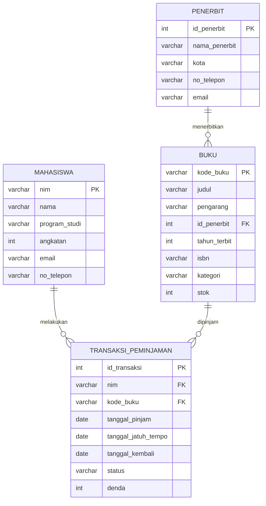

# Tugas Mandiri: Perancangan ERD E-Library Kampus

**Nama:** Isyraq Awwal Uthorid
**NIM:** D121241075

## 1. Deskripsi Skenario

Sistem E-Library Kampus mengelola proses peminjaman buku perpustakaan. Sistem perlu
menyimpan data mahasiswa sebagai peminjam, data buku beserta penerbitnya, dan riwayat
setiap transaksi peminjaman hingga pengembalian buku.

## 2. Identifikasi Entitas dan Relasi

Berdasarkan skenario, teridentifikasi empat entitas utama:

| Entitas | Deskripsi |
|---|---|
| Mahasiswa | Pihak yang meminjam buku |
| Buku | Koleksi buku yang tersedia di perpustakaan |
| Penerbit | Pihak yang menerbitkan buku |
| Transaksi Peminjaman | Catatan peminjaman dan pengembalian buku oleh mahasiswa |

Relasi antar entitas:

| Relasi | Kardinalitas | Keterangan |
|---|---|---|
| Penerbit - Buku | 1 ke N | Satu penerbit dapat menerbitkan banyak buku, satu buku hanya diterbitkan oleh satu penerbit |
| Mahasiswa - Transaksi Peminjaman | 1 ke N | Satu mahasiswa dapat melakukan banyak transaksi peminjaman |
| Buku - Transaksi Peminjaman | 1 ke N | Satu buku dapat dipinjam berkali-kali pada transaksi yang berbeda |

## 3. Diagram ERD

